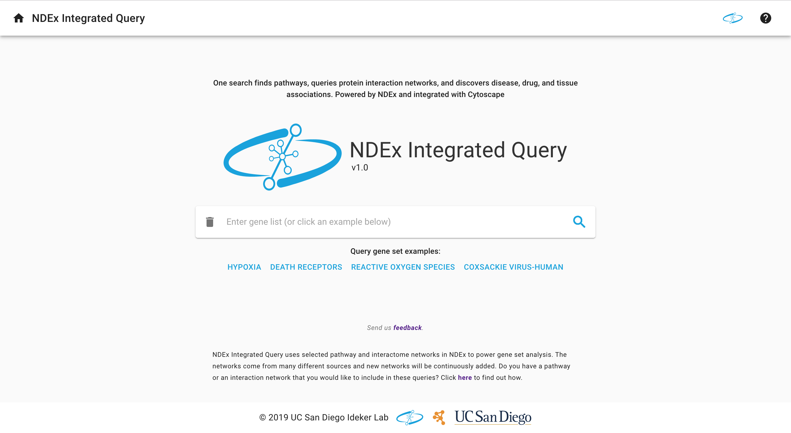
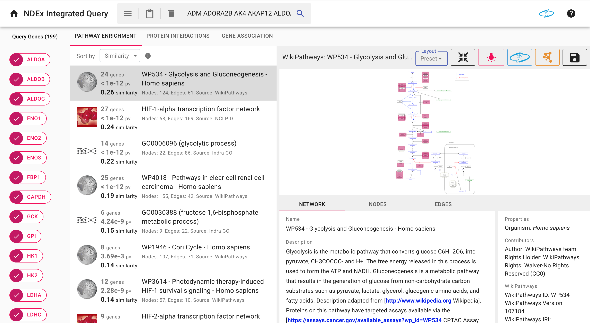
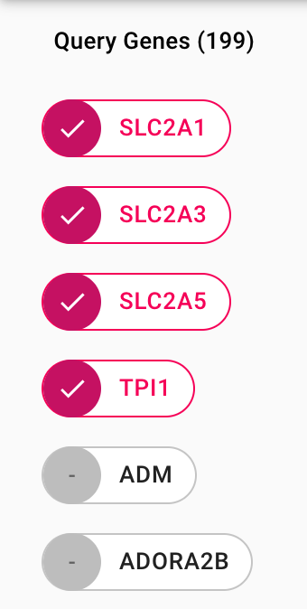
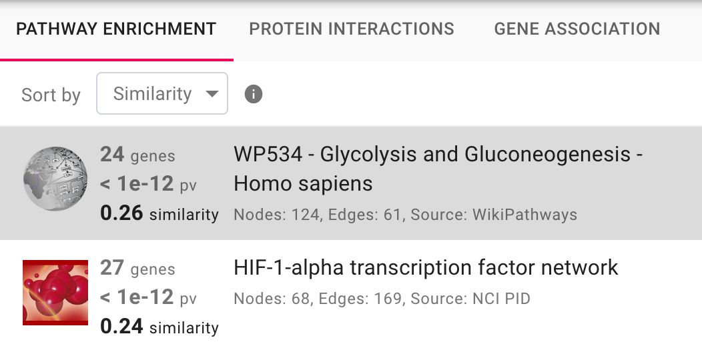
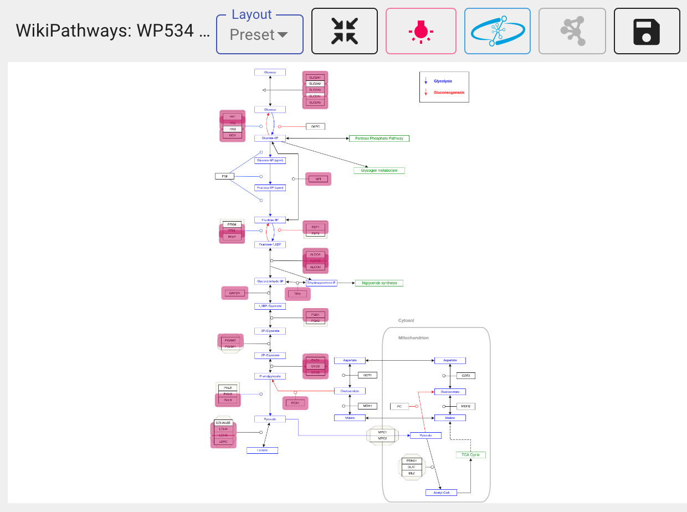
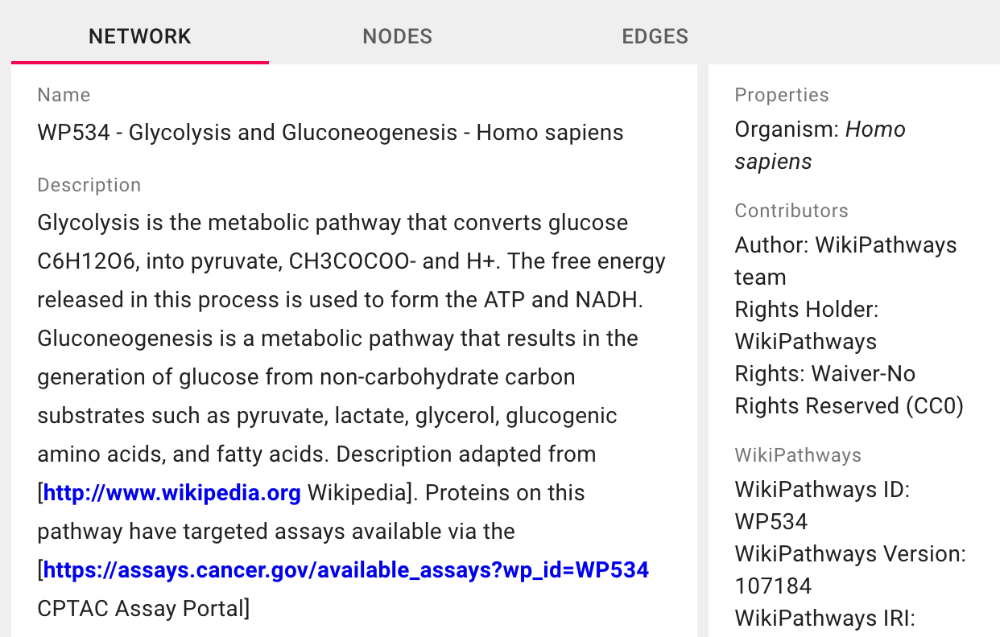

# NDEx Integrated Query (IQuery)



## What is IQuery?
IQuery is a web application for querying a curated subset of the online biological network repository [NDEx](https://ndexbio.org). Given a set of query genes, IQuery will return NDEx pathways enriched for the query genes, networks representing the interactions between those genes and other proteins, and networks representing the associations between those genes and other biological or chemical entities. IQuery is designed such that new types of searches and analyses may be added in the future.

Users can request to have their networks included in the search by uploading their networks to [NDEx](https://ndexbio.org) and [contacting us](https://home.ndexbio.org/contact-us/).

## Quick start guide for users

Go to [iquery.ndexbio.org](http://iquery.ndexbio.org) and click one of the query gene set examples to launch a query with an example set of genes.



The query results page has a toolbar at the top, and three panels. The panels can be resized by dragging the gray boundaries between them.

### Toolbar


* To return to the home page, click the home icon in the toolbar. 
* To access the query gene set examples from the home page, click the hamburger menu in the search bar. 
* To copy the contents of the search bar to the clipboard, click the clipboard icon. 
* To delete the contents of the search bar, click the trash icon. To perform a new search, type a new set of genes into the search text box and either press ```Enter``` or click the search icon. 
* To go to the [NDEx](https://ndexbio.org) website, click the NDEx logo to the right of the search bar. 
* To go to the IQuery wiki, click the help icon to the right of the NDEx logo. 

All external links will be opened in new tabs.

### Left panel



The left panel lists the genes in the query. Genes and gene groups that are found in the currently selected network are shown in pink, and genes that are not found are shown in gray. Clicking on a pink gene in the left panel will cause the network view in the right panel to zoom into that gene. Clicking the gene in the left panel again will cause the network view to zoom back out.

### Middle panel



The middle panel lists the networks that have been returned from the search. Currently, IQuery performs three kinds of searches for each query: [pathway enrichment](#pathway-enrichment), [protein interactions](#protein-interactions), and [gene association](#gene-association). Clicking on the tab for a search type will display the results of that search.

#### Pathway Enrichment

This search returns biological pathways that are enriched for the genes in the query. Results can be sorted by number of overlapping genes, p-value, or cosine similarity. For more information about sorting, click the information icon beside the "Sort by" drop-down menu.

#### Protein Interactions

This search returns the neighborhood of the query genes in a large network where edges represent interactions between proteins. Results are sorted by the number of query genes found in the network

#### Gene Association

This search returns the neighborhood of the query genes in a large network where edges represent interactions between a protein and a non-protein entity, such as a chemical, or a location in the cell. Results are sorted by the number of query genes found in the network.

### Right panel

The right panel displays information about the currently selected network. The top half of the right panel contains the [network view](#network-view), which displays the network and some options for manipulating the network. The bottom half of the right panel contains other [network information](#network-information). 

#### Network view



The network view has its own toolbar, containing options for manipulating the network displayed below it.

* To read the entire network title, hover over the visible portion of the title, and the whole title will come up in a tooltip.
* To change the layout of the network, use the Layout drop-down menu, which will display all available layouts.
* To zoom out or re-center the network, click the black "Fit network to panel" button to the right of the Layout drop-down menu.
* To toggle whether the genes in the network which are also in the query are highlighted in pink, click the pink "Highlight genes" button.
* To open the network in NDEx, click the blue "Open original network in new browser window" button.
* To open the network in Cytoscape, make sure that Cytoscape is open, then click the orange "Open this network in Cytoscape Desktop" button.
* To save the network to your NDEx account, click the black "Save this network to your NDEx account" button on the very right side of the toolbar. This will bring up a modal which will allow you to sign into your NDEx account, save the network to your account, and open the new copy of the network in a new tab.

The view of the network itself supports zooming, panning, selecting nodes and edges, and moving nodes.

* To zoom in, hover over the network panel and scroll down. To zoom out, scroll up.
* To pan, click and hold the background of the network, and drag in the desired direction.
* To select a node or edge, click the node or edge.
* To select multiple nodes or edges, hold down the ```Shift``` key and click the desired nodes and edges.
* To select all the nodes and edges in an area, hold down the ```Shift``` key, and click and drag over the desired area.
* To deselect all nodes and edges, click on the network's background.
* To move a node, click and drag the node.
* To move all selected nodes, click and drag a selected node.

If a network has a preset layout, the original layout can be restored by switching to a different layout and then switching back.

#### Network information



Beneath the network view, there is an area for network information, with three tabs: [Network](#network), [Nodes](#nodes), and [Edges](#edges). All links open in new tabs.

##### Network

By default, the Network tab is open. This tab displays network information such as the network's name, description, properties, contributors, and namespaces. 

##### Nodes

Selecting a node or nodes in the network, or clicking the Nodes tab, will open the Nodes tab. If there are nodes selected, then only the information for the selected nodes will be shown. If nodes are not selected, information for all nodes will be shown. Nodes corresponding to genes which are in the query will have pink checkmarks next to their names. Clicking on a node name will hide or show that node's information. The information for query nodes contains a [GeneCards](https://www.genecards.org/) summary of the gene's function.

##### Edges

Selecting an edge or edges, or clicking the Edges tab, will open the Edges tab. If there are edges selected, then only the information for the selected edges will be shown. If there are no edges selected, then information for all edges will be shown. Edge names take the form: source node name → target node name. If the source or target node represents a gene which is a part of the query, then there will be a pink checkmark next to the name.

## Quick start guide for developers

IQuery is implemented using [React](https://reactjs.org/).

```
git clone https://github.com/cytoscape/search-portal.git
cd search-portal
yarn install
yarn start
```

### Configuration

The host name of the web server and endpoint of REST services are hard coded in the file `apiConstants.js`.

```
search-portal
|-- src
    |-- api
        |-- apiConstants.js
```

The variable `SERVICE_SERVER_URL` should point to the NDEx server where the desired networks are stored, and the variable `BASE_URL` should point to the base url for the endpoints of REST services.

#### Example configuration
```
export const METHOD_POST = 'POST
export const METHOD_GET = 'GET'

export const SERVICE_SERVER_URL = 'http://ndexbio.org/'
export const BASE_URL = SERVICE_SERVER_URL + 'integratedsearch/v1/'
```

### Building and deploying with Docker

**Step 1**: Build IQuery

```
cd search-portal
yarn build
```

**Step 2**: Copy build file to Docker directory

```
search-portal
|-- build    <-- copy everything in here . . .
|-- docker
    |-- static    <-- . . . to in here
```

```
cd search-portal
cp -rn build/* docker/static
```

**Step 3**: Build and run Docker image
```
cd search-portal/docker
docker build -t portal .
docker run --name search-portal -d -p 80:80 portal
```
